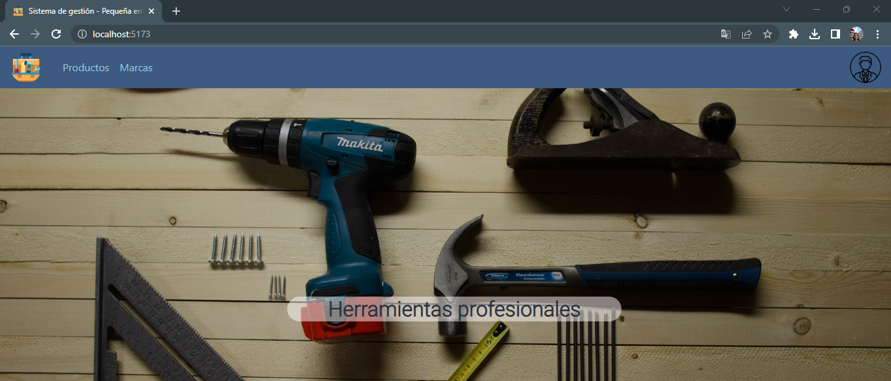
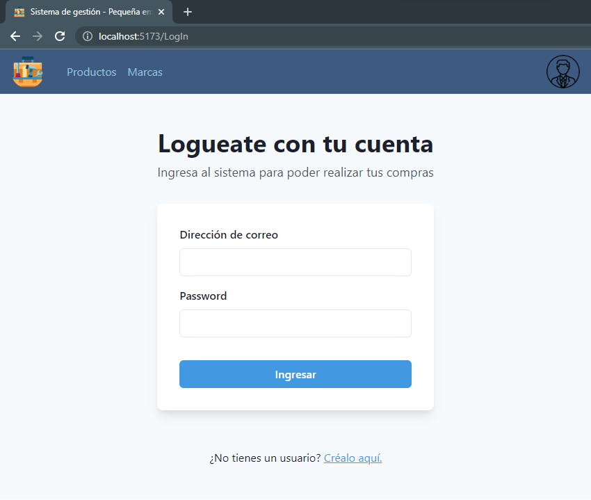
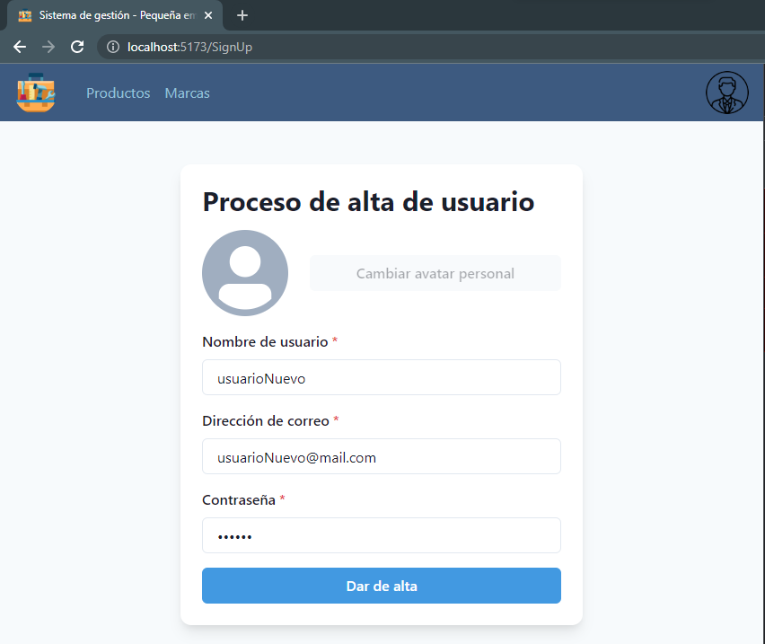
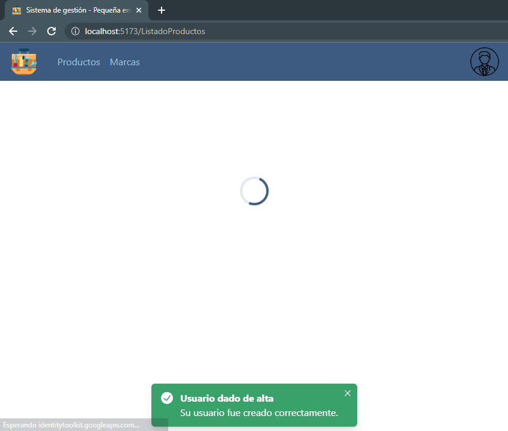
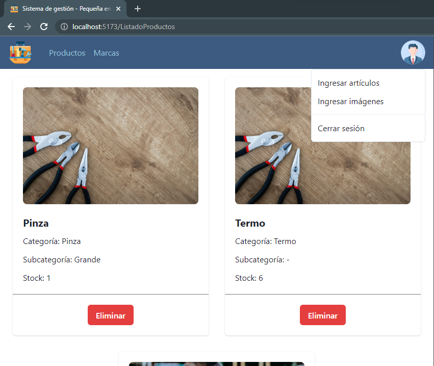
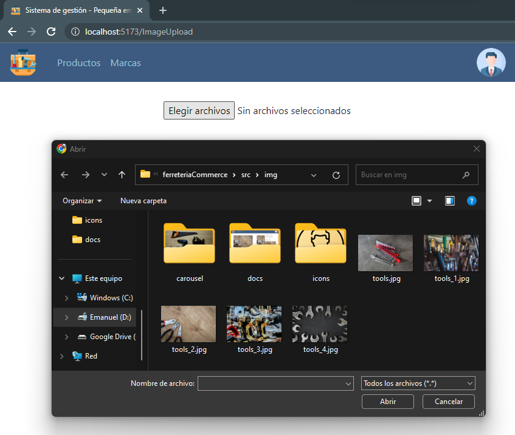
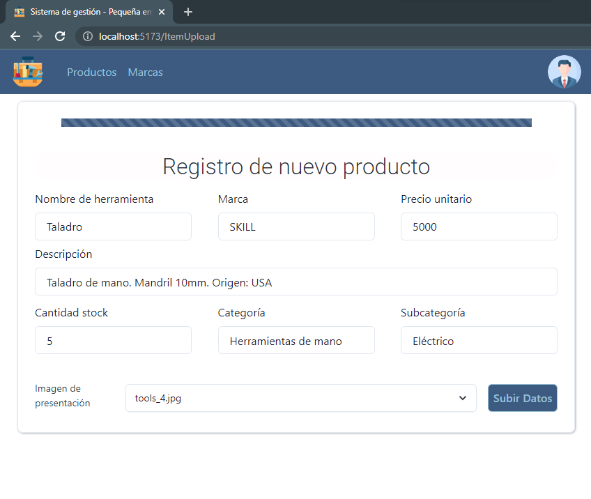
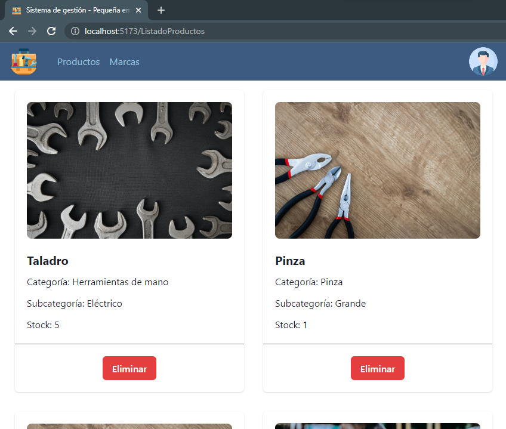

# eCommerce para gestión de un pequeño comercio
> Desarrollado en el marco del curso de React de CoderHouse. Estudiante: Emanuel Moroni; Profesor: Omar Maniás

## Landing Page

La página inicial que verá el usuario será un breve landing page donde podrá interactuar con un carousel para conocer características de la empresa que comercializa las herramientas que se encontrarán en sitio. Si bien accediendo a la sección de productos, ya se pueden ver toda la disponibilidad con la que se cuenta, no se podrán agregar al carrito ninguno de ellos hasta que el usuario ingrese con su perfil.

Para lo último mencionado, solo basta con hacer click en el avatar del personaje que se puede ver en la esquina superior derecha.

Gestión de usuarios
===
- Usuarios finales de la plataforma

Para un usuario que ya tiene una cuenta creada, solo bastará que ingrese al sistema con su correo y contraseña. Esto es muy importante ya que las ordenes de compra que realizará quedarán registradas con este correo e información de usuario.

Pero, en caso de que el usuario aún no cuente con una cuenta registrada, podrá dar de alta la misma ingresando en el link inferior en el que se indica la creación de una nueva cuenta de usuario.

El nuevo usuario deberá completar los campos necesarios para recién poder dar de alta su cuenta. La opción de selección de un avatar personal todavía no fue desarrollada en esta versión del proyecto. Cualquier inconveniente que impida la creación de un nuevo usuario será indicado mediante un mensaje en pantalla.

Una vez creado con éxito el nuevo usuario, el mismo será redirigido a la página principal para que pueda agregar los productos que desee a su carrito. Lo mismo ocurrirá con cualquier usuario que ya hubiese estado de alta en la plataforma e ingrese para poder realizar las compras que desee.

- Usuario admin

Existe un usuario administrador ya generado en este proyecto, el cual tendrá opciones de gestión diferentes a la que tiene un usuario común. El aministrador se podrá loguear desde el mismo espacio que cualquier otro usuario, pero sus credenciales serán las siguientes:

    * user: admin@mail.com  
    * password: 123456

El usuario administrador podrá agregar nuevos productos, nuevas imágenes para asociar a cada uno de estos productos y podrá eliminar cualquiera de los elementos en venta. La sección de edición de cada producto aún se encuentra en desarrollo en esta etapa del proyecto.

Gestión de productos
===

El usuario administrador dentro de su perfil tendrá tres posibilidades de gestión,

    1. El ingreso de nuevas imágenes para asociar a los productos
    1. El ingreso de nuevas herramientas en venta    
    3. La eliminación de cualquiera de los artículos publicados

1. Ingreso de nuevas imágenes

La selección de la imagen que se desea subir a la plataforma es como cualquier otro proceso de carga de información en los sistemas operativos de Windows, Mac y Linux. Seleccionando la opción de elegir archivo, se podrá acceder a los directorios de la computadora para buscar la imagen que finalmente se desea subir. El nombre con el que se actualice, será el nombre con el que se encontrará en el sistema de gestión.

2. Ingreso de nuevos productos para la venta

El proceso de alta de nuevos artículos es simplemente el llenado de un formulario con la información relevante a cada uno de ellos. Dentro del desplegable de imagen de presentación se podrán observar las imágenes ya cargadas en el sistema. La opción de subir los datos se habilitará una vez completado todos los campos necesarios.

3. Eliminación de artículos

Por último, el usuario administrador, podrá desde la sección de productos eliminar cualquiera de ellos según lo desee. Una vez eliminados, el usuario final no podrá verlos más en las opciones de compra.

