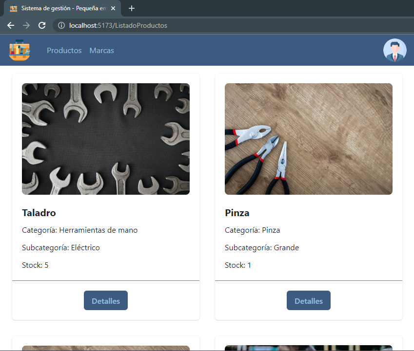
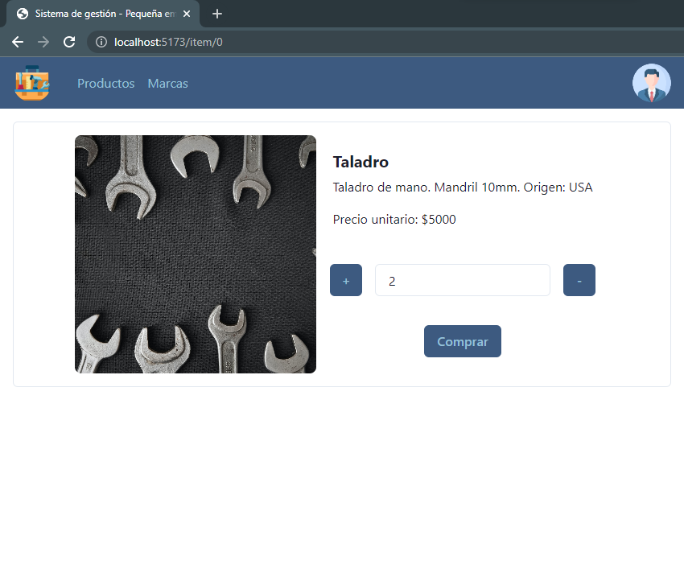
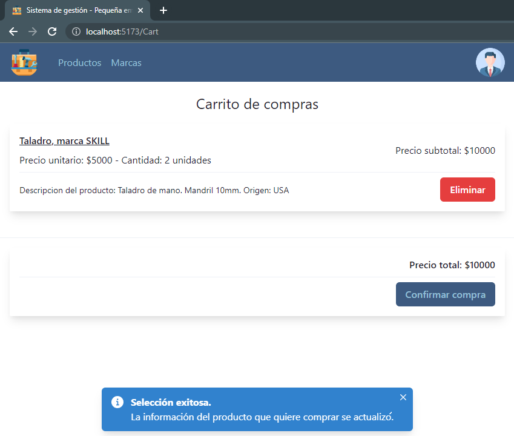
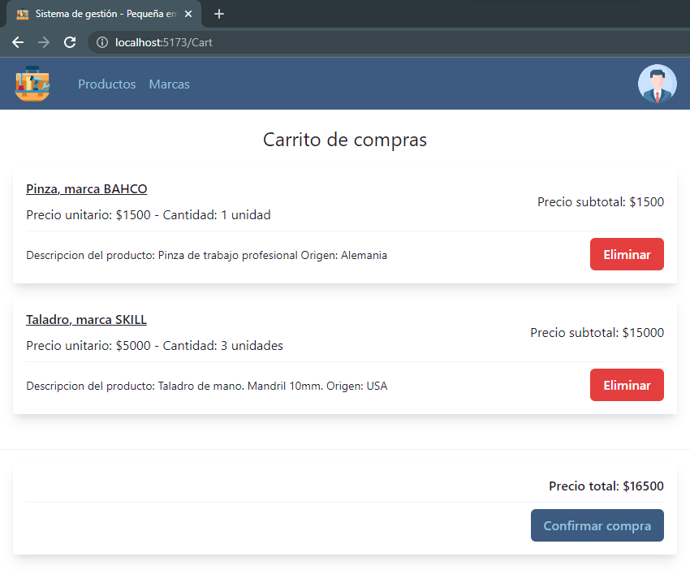
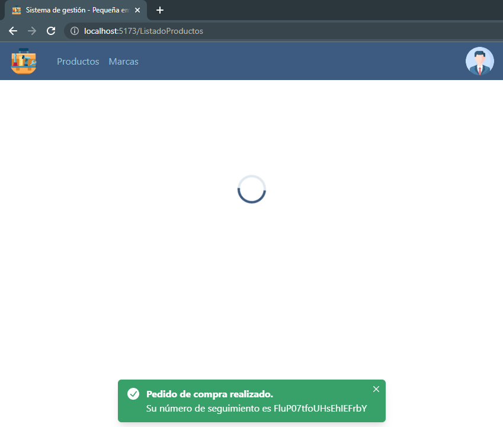
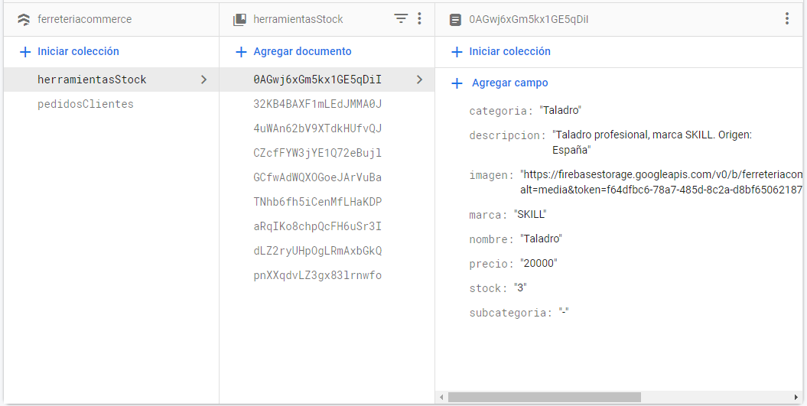
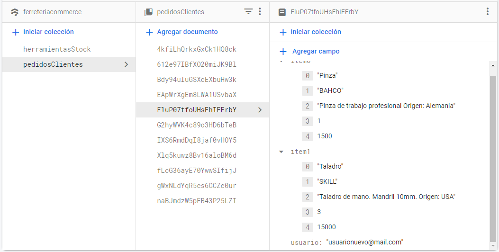
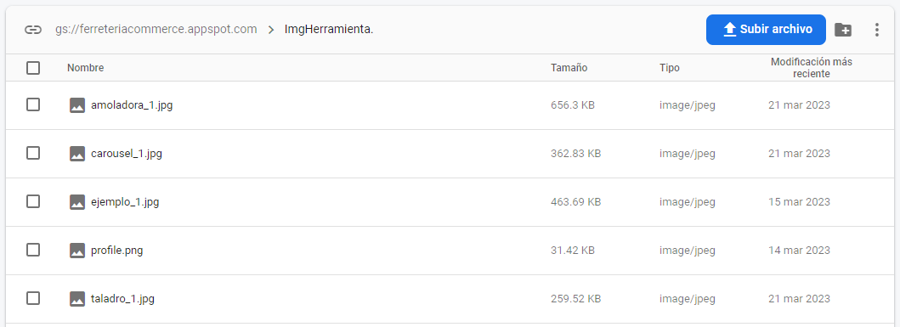
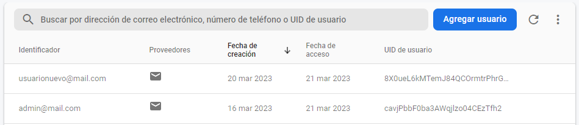

# eCommerce para gestión de un pequeño comercio
> Desarrollado en el marco del curso de React de CoderHouse. Estudiante: Emanuel Moroni; Profesor: Omar Maniás

## Landing Page

La página inicial que verá el usuario será un breve landing page donde podrá interactuar con un carousel para conocer características de la empresa que comercializa las herramientas que se encontrarán en sitio. Si bien, accediendo a la sección de productos ya se pueden ver toda la disponibilidad con la que se cuenta, no se podrán agregar al carrito ninguno de ellos hasta que el usuario ingrese con su perfil.

Para lo último mencionado, solo basta con hacer click en el avatar del personaje que se puede ver en la esquina superior derecha.

Gestión de usuarios
===
- Usuarios finales de la plataforma

Para un usuario que ya tiene una cuenta creada, solo bastará que ingrese al sistema con su correo y contraseña. Esto es muy importante ya que las ordenes de compra que realizará quedarán registradas con este correo e información de usuario.

Pero, en caso de que el usuario aún no cuente con una cuenta registrada, podrá dar de alta la misma ingresando en el link inferior en el que se indica la creación de una nueva cuenta de usuario.

El nuevo usuario deberá completar los campos necesarios para recién poder dar de alta su cuenta. La opción de selección de un avatar personal todavía no fue desarrollada en esta versión del proyecto. Cualquier inconveniente que impida la creación de un nuevo usuario será indicado mediante un mensaje en pantalla.

Una vez creado con éxito el nuevo usuario, el mismo será redirigido a la página principal para que pueda agregar los productos que desee a su carrito. Lo mismo ocurrirá con cualquier usuario que ya hubiese estado de alta en la plataforma e ingrese para poder realizar las compras que desee.

- Usuario admin

Existe un usuario administrador ya generado en este proyecto, el cual tendrá opciones de gestión diferentes a la que tiene un usuario común. El aministrador se podrá loguear desde el mismo espacio que cualquier otro usuario, pero sus credenciales serán las siguientes:

    * user: admin@mail.com  
    * password: 123456

El usuario administrador podrá agregar nuevos productos, nuevas imágenes para asociar a cada uno de ellos y también podrá eliminar cualquiera de los elementos en venta. La sección de edición de cada producto aún se encuentra en desarrollo en esta etapa del proyecto.

Gestión de productos
===

El usuario administrador dentro de su perfil tendrá tres posibilidades de gestión,

    1. El ingreso de nuevas imágenes para asociar a los productos
    2. El ingreso de nuevas herramientas en venta    
    3. La eliminación de cualquiera de los artículos publicados

1. Ingreso de nuevas imágenes

La selección de la imagen que se desea subir a la plataforma es como cualquier otro proceso de carga de información en los sistemas operativos de Windows, Mac y Linux. Seleccionando la opción de _elegir archivo_, se podrá acceder a los directorios de la computadora para buscar la imagen que finalmente se desea subir. El nombre con el que se actualice, será el nombre con el que se encontrará en el sistema de gestión.

2. Ingreso de nuevos productos para la venta

El proceso de alta de nuevos artículos es simplemente el llenado de un formulario con la información relevante a cada uno de ellos. Dentro del desplegable de imagen de presentación se podrán observar las imágenes ya cargadas en el sistema. La opción de subir los datos se habilitará una vez completado todos los campos necesarios.

3. Eliminación de artículos

Por último, el usuario administrador, podrá desde la sección de productos eliminar cualquiera de ellos según lo desee. Una vez eliminados, el usuario final no podrá verlos más en las opciones de compra.

Generación de nueva orden de compra
===

El usuario final de la plataforma será capaz de realizar pedidos de compra y obtener a partir de cada uno de ellos un número de seguimiento único. Aún no se encuentra en esta etapa del proyecto, pero también podrá observar todos los números de ordenes realizadas y evaluar el estado en el que se encuentran.

Una vez logueado con su cuenta correspondiente el usuario podrá acceder a los detalles de cada uno de los artículos en venta disponibles en la plataforma. En cada uno de ellos podrá ver el stock actualizado y, para visualizar los detalles y agregar al carrito, deberá hacer click en el botón de detalles en cada uno de ellos.

Dentro del detalle de cada artículo podrá agregar la cantidad deseada que quiere comprar, siempre y cuando la misma no sea menor a 1 ni mayor al stock. Una vez seleccionado la cantidad de items necesarios de cada artículo, el stock se modificará en la base de datos y se actualizará el carrito de compras del usuario.

En caso de que el usuario, luego de ya haber seleccionado un artículo, y el mismo ya se encontrase en el carrito de compras, el mismo se sumará a la cantidad pedida anteriormente, resultando solo la sumatoria de items de un mismo artículo. La cantidad de artículos en el carrito de compra se podrán ver en el avatar de su perfil.

Finalmente, al confirmar la orden de compra, se generará un código de seguimiento único, asociado a cada usuario, y se retornará a la página principal de compras donde podrá realizar nuevos pedidos y ver los productos, ya con el stock actualizado.

Servicios de Firebase
===

Los servicios de Firebase utilizados fueron,

    1. Firestore
    2. Storage    
    3. Storage

1. Firebase Firestore

En el servicio de base de datos se crearon dos colecciones de documentos. La primera de ellas, llamada __herramientasStock__, contiene documentos por cada una de las herramientas que se agreguen para que el cliente las pueda adquirir. Como se puede ver, cada documento contiene diferentes campos, pero en particular el de imagen tiene asociado un vínculo a las imagenes almacenadas en Storage.

Por otro lado, la colección __pedidosClientes__ contiene documentos que almacen los items pedidos porque cada cliente y el correo asociado a cada uno de ellos. En futuras etapas del proyectos, el usuario administrador podrá filtrar los pedidos según cada uno de los clientes que lo hayan solicitado. El id único generado automáticamente es el número de seguimiento que se le comparte al cliente al momento de hacer la orden de compra.

2. Firebase Storage

Este servicio se uso simplemente para almacenar las imágenes que se asocian a cada uno de los artículos que el arministrador da de alta. Varios artículos pueden compartir la misma imagen de referencia y, al menos en esta etapa del proyecto, solo se utilizo este recurso con esta simple finalidad.

3. Firebase Authtentication

Firebase provee diferentes formas de autenticación. Entre ellas se encuentra la verificación por correo y contraseña, la cual fue la que se utilizo. Como se puede ver cada usuario agregado en el sistema de autenticación posee un id único, y contra este es el que se verifica que el usuario admin se este logueando para hacer las tareas que tiene asignadas según sus permisos. De igual manera, este servicio se utiliza para validar que los usuarios se encuentren dados de alta en la plataforma.

